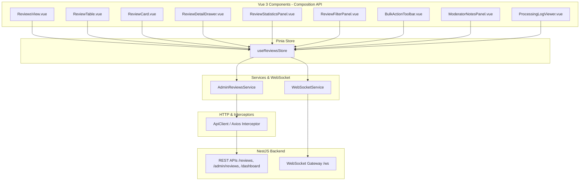

# Phase A5 – Review Management Architecture Blueprint

## 1. Executive Summary & Architectural Goals
The **Review Management Module** (`apps/admin/src/features/reviews`) provides system administrators with total governance, real-time monitoring, inspection, and moderation over AI-driven code reviews across the platform.

Key Objectives:
- **Clean Architecture & Feature-based Modularization**: Encapsulating all review logic, components, composables, and views inside `src/features/reviews` while connecting with shared core infrastructure.
- **SOLID Compliance**: Single-responsibility components (e.g. badges, logs, drawers), clear service contracts, and dependency inversion through centralized API clients and Pinia stores.
- **Enterprise Performance**: Virtualized lists, server-side pagination, debounced filtering, and cached query states.
- **Real-Time Synchronicity**: Integration with existing WebSocket infrastructure (`websocket.service.ts`) for real-time review updates (creation, completion, failure, rerun).

---

## 2. System Layer Diagram

---

## 3. Data & State Flow
1. **Fetch & Cache**: `ReviewsView.vue` initializes `useReviewsStore().fetchReviews(query)`.
2. **Reactivity**: Query states (filters, search, sorting, page index) trigger reactive re-fetching with debounced inputs.
3. **Selection & Drawers**: Clicking a review loads full detail (`fetchReviewById`) into `selectedReview` and opens `ReviewDetailDrawer.vue`.
4. **Actions & Moderation**: Actions (rerun, delete, archive, restore, flag, moderator notes) invoke store actions which execute REST API endpoints, optimistically updating or re-fetching states.
5. **Real-time Event Ingestion**: `WebSocketService` listens for `review:created`, `review:completed`, `review:failed`, `review:rerun`, `review:deleted` and notifies `useReviewsStore()` to update existing list items or refresh stats.

---

## 4. API Endpoint Integration Mapping

| Action | Primary REST Endpoint | Fallback / Adaptation | Method |
| :--- | :--- | :--- | :--- |
| List Reviews | `/admin/reviews` | `/reviews` | `GET` |
| Get Review Detail | `/admin/reviews/:id` | `/reviews/:id` | `GET` |
| Re-run Review | `/admin/reviews/:id/rerun` | `/reviews/:id/rerun` | `PATCH` |
| Delete Review | `/admin/reviews/:id` | `/reviews/:id` | `DELETE` |
| Archive Review | `/admin/reviews/:id/archive` | `/reviews/:id/archive` | `PATCH` |
| Restore Review | `/admin/reviews/:id/restore` | `/reviews/:id/restore` | `PATCH` |
| Download Report | `/admin/reviews/:id/report` | `/reviews/:id/report` | `GET` |
| Moderation Notes & Flag | `/admin/reviews/:id/moderation` | `/reviews/:id/moderation` | `PATCH` |
| Review Statistics | `/admin/reviews/stats` | `/dashboard/admin-summary` | `GET` |

---

## 5. Non-Functional & Enterprise Requirements
- **TypeScript Strictness**: Interfaces for `CodeReviewItem`, `ReviewDetail`, `ReviewFilterQuery`, `ReviewStats`, and `ModerationAction`.
- **Accessibility**: Keyboard shortcut support (`Esc` to close drawer), focus trapping, ARIA roles (`role="table"`, `role="dialog"`, `aria-expanded`).
- **Resilience & UX**: Skeleton loaders for initial load, empty states for unmatched filters, and retry handlers for API failures.
