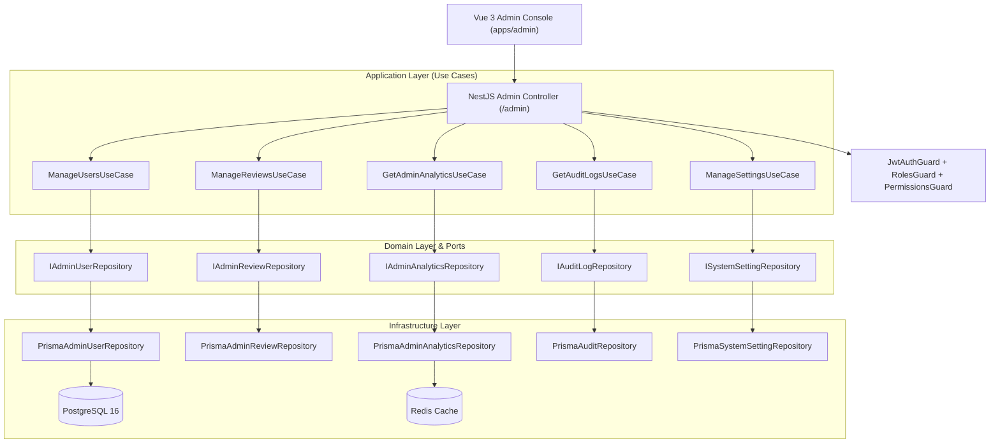

# 🏛️ Phase 8 — Admin Portal & Platform Management Architecture Specification

## 1. System Overview
The **Admin Portal & Platform Management System** provides enterprise administrators and moderators with deep operational control over users, code reviews, system health metrics, security policies, and platform settings.

Key Architectural Highlights:
- **Clean Architecture & DDD**: Clear boundary separation between Admin Domain models, Use Cases, REST Adapters, and Vue 3 Pinia UI.
- **Hierarchical RBAC & Fine-Grained Permissions (FGAC)**: Multi-tiered roles (`SUPER_ADMIN`, `ADMIN`, `MODERATOR`, `USER`) enforced with permission strings (`users.read`, `users.update`, `users.delete`, `reviews.read`, `reviews.delete`, `reviews.rerun`, `analytics.read`, `audit.read`, `settings.update`).
- **Audit-First Design**: Immutable audit logs capturing every user state change, review action, administrative elevation, and configuration update.
- **Real-Time Analytics & System Observability**: Aggregated metrics on active users, AI provider throughput, queue statistics, storage usage, and quality score distributions.
- **Dynamic Platform Configuration**: Key-value system settings with runtime feature toggling (maintenance mode, rate limits, upload caps, default AI provider).

---

## 2. Component Architecture & Layer Flow

---

## 3. Core Entities & Permission Matrix

### Roles & Permission Matrix

| Permission | SUPER_ADMIN | ADMIN | MODERATOR | USER |
| :--- | :---: | :---: | :---: | :---: |
| `users.read` | ✅ | ✅ | ✅ | ❌ |
| `users.update` | ✅ | ✅ | ❌ | ❌ |
| `users.delete` | ✅ | ❌ | ❌ | ❌ |
| `reviews.read` | ✅ | ✅ | ✅ | ❌ |
| `reviews.delete` | ✅ | ✅ | ✅ | ❌ |
| `reviews.rerun` | ✅ | ✅ | ❌ | ❌ |
| `analytics.read` | ✅ | ✅ | ✅ | ❌ |
| `audit.read` | ✅ | ✅ | ❌ | ❌ |
| `settings.update` | ✅ | ❌ | ❌ | ❌ |

---

## 4. SOLID & Architectural Principles Applied

1. **Single Responsibility Principle (SRP)**:
   - Separate use cases for user management, review moderation, analytics extraction, audit log queries, and system setting updates.
2. **Open/Closed Principle (OCP)**:
   - System settings schema allows adding arbitrary configuration keys without changing database structure or application layer contracts.
3. **Liskov Substitution Principle (LSP)**:
   - Repository implementations fulfill abstract ports (`IAdminUserRepository`, `ISystemSettingRepository`) cleanly.
4. **Interface Segregation Principle (ISP)**:
   - Dedicated repository ports for Admin Users, Admin Reviews, Analytics, Auditing, and Settings.
5. **Dependency Inversion Principle (DIP)**:
   - Admin controllers and use cases depend on port interfaces rather than Prisma concrete classes.

---

## 5. Execution Plan & Next Steps

1. ✅ **Step 1: Admin Architecture** (Domain Entities, Enums, Port Interfaces, Design Blueprint)
2. ⏳ **Step 2: Database Schema** (Updating `schema.prisma` for Role permissions, SystemSettings, AuditLogs)
3. ⏳ **Step 3: Prisma Models** (Running `prisma generate` & client validation)
4. ⏳ **Step 4: Admin Module** (NestJS module wiring)
5. ⏳ **Step 5: DTOs** (Validation-decorated request & response DTOs)
6. ⏳ **Step 6: Repositories** (Prisma persistence implementations)
7. ⏳ **Step 7: Services** (Application use cases for admin functionality)
8. ⏳ **Step 8: Controllers** (REST API endpoints under `/admin/*`)
9. ⏳ **Step 9: RBAC & Permissions** (Guards and `@RequirePermissions()` decorators)
10. ⏳ **Step 10: Vue Admin UI** (Vue 3 Pinia UI components, User Table, Review Table, Settings Form)
11. ⏳ **Step 11: Analytics** (Real-time metric aggregations & Redis caching)
12. ⏳ **Step 12: Audit Logs** (Automatic audit tracking on sensitive administrative operations)
13. ⏳ **Step 13: System Settings** (Dynamic configuration endpoints & feature toggles)
14. ⏳ **Step 14: Testing** (Unit & integration tests for RBAC & Admin APIs)
15. ⏳ **Step 15: Documentation** (Final technical architecture & API docs)
