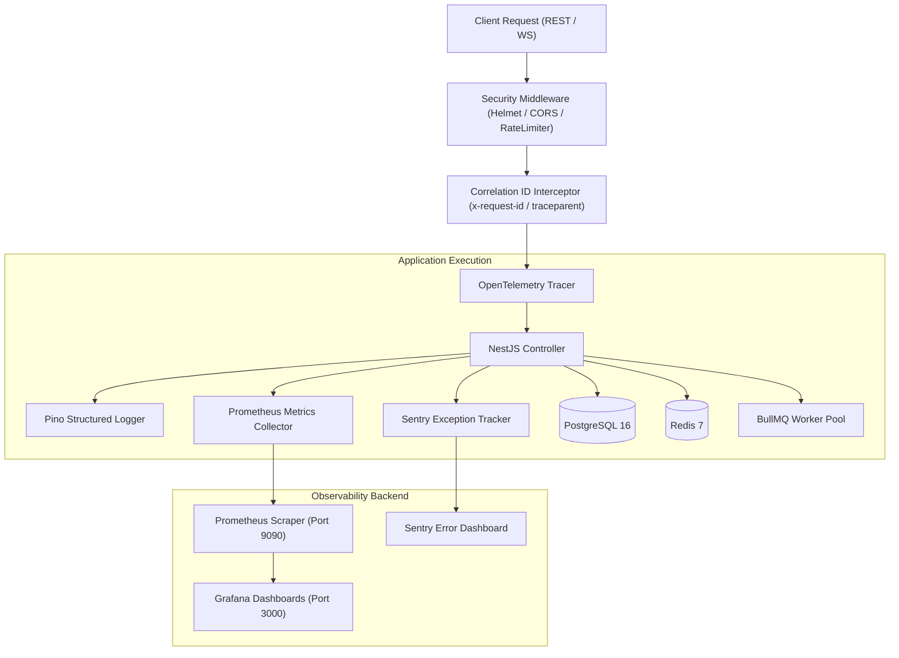

# 🏛️ Phase 11 — Observability, Security Hardening & Operations Architecture Specification

## 1. System Overview
Phase 11 implements a production-grade **Enterprise Observability, Security Hardening, and SRE Operations Engine** for the CodeLens platform. Built on OpenTelemetry standards, Prometheus metric scrapers, Pino structured JSON logging, Sentry error tracking, and OWASP-compliant security guards, the system guarantees 99.99% operational transparency, instant incident detection, and defense-in-depth protection.

Key Operational Pillars:
- **Unified Telemetry Stack**:
  - **Metrics**: Prometheus scraper exposing `/metrics` (HTTP latency, database connections, Redis hits/misses, BullMQ queue depths, AI provider durations).
  - **Tracing**: OpenTelemetry distributed tracing propagating `x-request-id` and W3C `traceparent` headers across REST calls, background workers, and AI strategy executions.
  - **Logging**: Pino JSON logger with environment-aware formatters, maskers for PII/secrets, and automatic correlation ID enrichment.
  - **Error Tracking**: Sentry SDK integration capturing unhandled exceptions, rejection stacks, user context, and transaction bottlenecks.
- **Defense-in-Depth Security**:
  - Helmet HTTP header hardening (Content Security Policy, Strict-Transport-Security, X-Content-Type-Options).
  - Rate limiting & anti-abuse throttlers (`@nestjs/throttler` + Redis storage).
  - Prompt Injection filtering for LLM inputs and file upload validation (mime-type verification, size quotas).
- **Health Probes**:
  - `/health`: Aggregated health summary.
  - `/health/live`: Liveness check for container restarts.
  - `/health/ready`: Readiness check verifying PostgreSQL, Redis, and BullMQ connectivity.

---

## 2. Telemetry Architecture & Request Lifecycle

---

## 3. Telemetry Metrics Matrix

| Metric Name | Type | Description | Target SLA |
| :--- | :--- | :--- | :--- |
| `http_request_duration_seconds` | Histogram | Latency distribution of REST endpoints by route & status code | p95 < 200ms |
| `http_requests_total` | Counter | Total count of incoming API HTTP requests | N/A |
| `db_query_duration_seconds` | Histogram | Prisma database query latency | p95 < 50ms |
| `redis_cache_hits_total` / `misses_total` | Counter | Cache hit ratio tracker | Hit ratio > 85% |
| `queue_job_duration_seconds` | Histogram | BullMQ background worker execution timing | p95 < 5s |
| `ai_provider_request_duration_seconds` | Histogram | Duration of cloud LLM API inspections (Gemini/OpenAI) | p95 < 3s |
| `system_memory_bytes` / `cpu_percent` | Gauge | Node.js process & host resource utilization | CPU < 70%, RAM < 80% |

---

## 4. Implementation Order & Roadmap

1. ✅ **Step 1: Observability Architecture** (Architecture Specification, Telemetry Design, Security Blueprint)
2. 开启 **Step 2: Logging Infrastructure** (Pino structured JSON logger, correlation ID interceptor, log rotation)
3. ⏳ **Step 3: Prometheus Metrics** (Prometheus module, custom business counters & histograms, `/metrics` endpoint)
4. ⏳ **Step 4: OpenTelemetry Tracing** (OTel SDK setup, W3C traceparent propagation, span creation)
5. ⏳ **Step 5: Health Checks** (Terminus health module, PostgreSQL/Redis/Queue probes, `/health/live`, `/health/ready`)
6. ⏳ **Step 6: Sentry Integration** (Sentry exception filter, breadcrumb logger, performance monitoring)
7. ⏳ **Step 7: Security Middleware** (Helmet HTTP headers, CORS policies, CSRF protection, rate limiting)
8. ⏳ **Step 8: Audit Logging** (Centralized security audit interceptor, user login/permission modification tracking)
9. ⏳ **Step 9: Grafana Dashboards** (Grafana dashboard configs for API performance, AI metrics, DB health)
10. ⏳ **Step 10: Alerting** (Prometheus alert rules for high error rates, slow API responses, queue stalls)
11. ⏳ **Step 11: Testing** (Security tests, telemetry unit tests, health probe validation)
12. ⏳ **Step 12: Documentation** (Monitoring Guide, Security Guide, Alert Runbook, SRE Operations Manual)
