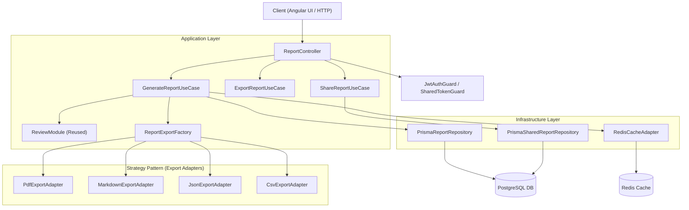

# 🏛️ Phase 7 — Reports & Export System Architecture Specification

## 1. System Overview
The **Reports & Export System** in CodeLens enables enterprise developers, team leads, and security auditors to transform raw AI review outputs into formal, high-impact inspection reports. 

Key Architectural Highlights:
- **Clean Architecture & DDD**: Strict layer separation across Domain, Application, Infrastructure, and Presentation. Core reporting rules remain decoupled from framework or transport logic.
- **Strategy Pattern for Multi-Format Exporters**: Unified `IExportAdapter` interface with dynamic dispatch for **PDF**, **Markdown**, **JSON**, and **CSV** output generators.
- **Template Engine**: Layout composition strategies for **Standard**, **Executive Summary**, **Technical**, and **Interview** report profiles.
- **Cryptographic Link Sharing**: Expiring, signed read-only access tokens for secure public/partner report distribution with revoke capabilities.
- **Caching & Performance Layer**: Redis-backed cache for compiled report payloads with asynchronous background generation for large multi-file repositories.

---

## 2. Component Diagram & Flow

---

## 3. Core Entities & Value Objects

| Entity / Value Object | Responsibilities | Key Fields |
| :--- | :--- | :--- |
| **`ReportEntity`** | Represents a generated report snapshot with versioning and soft delete | `id`, `reviewId`, `creatorId`, `format`, `templateType`, `status`, `version`, `content`, `downloadCount` |
| **`ReportTemplateEntity`** | Defines template layout rules and section visibilities | `id`, `name`, `type`, `config` (section toggles, issue limits) |
| **`SharedReportEntity`** | Secure public share token metadata with expiration and revoke status | `id`, `reportId`, `token`, `accessCount`, `isRevoked`, `expiresAt` |
| **`IReportContent`** | Complete structured domain snapshot of review analysis | `metadata`, `analysis` (Executive Summary, Quality Score, Issue Breakdown, Code Improvements, Complexity) |

---

## 4. SOLID & Architectural Principles Applied

1. **Single Responsibility Principle (SRP)**:
   - Export adapters only handle format translation (`IReportContent` -> `Buffer`).
   - Use Cases encapsulate single workflow actions (e.g., `GenerateReportUseCase`, `ShareReportUseCase`).
2. **Open/Closed Principle (OCP)**:
   - Adding a new export format (e.g., HTML, DOCX) requires adding a new `IExportAdapter` implementation without editing existing generation code.
3. **Liskov Substitution Principle (LSP)**:
   - Any `IExportAdapter` can be substituted seamlessly in `ReportExportFactory`.
4. **Interface Segregation Principle (ISP)**:
   - Split repository interfaces (`IReportRepository`, `ISharedReportRepository`) and export adapters into fine-grained contracts.
5. **Dependency Inversion Principle (DIP)**:
   - Application use cases depend on abstract ports (`IReportRepository`, `IExportAdapter`) rather than Prisma or specific file libraries.

---

## 5. Execution Plan & Next Steps

1. ✅ **Step 1: Reporting Architecture** (Domain Entities, Port Interfaces, Design Specification)
2. ⏳ **Step 2: Database Schema** (Prisma models: `Report`, `ReportTemplate`, `SharedReport` with indexes & relations)
3. ⏳ **Step 3: Report Module** (NestJS dependency injection module setup)
4. ⏳ **Step 4: DTOs** (Validation-decorated request & response DTOs)
5. ⏳ **Step 5: Repositories** (Prisma persistence implementations)
6. ⏳ **Step 6: Report Generation Service** (Business logic engine composing report content)
7. ⏳ **Step 7: Export Adapters** (PDF, Markdown, JSON, CSV generators)
8. ⏳ **Step 8: Controllers** (REST Endpoints with guards and OpenAPI documentation)
9. ⏳ **Step 9: Frontend Viewer** (Angular report viewer, score cards, export menu, print layout)
10. ⏳ **Step 10: Share System** (Public token validation, expiration enforcement, revoke modal)
11. ⏳ **Step 11: Caching** (Redis caching for fast report retrieval)
12. ⏳ **Step 12: Testing** (Unit tests, format validation, share token tests)
13. ⏳ **Step 13: Documentation** (Final technical architecture & API docs)
