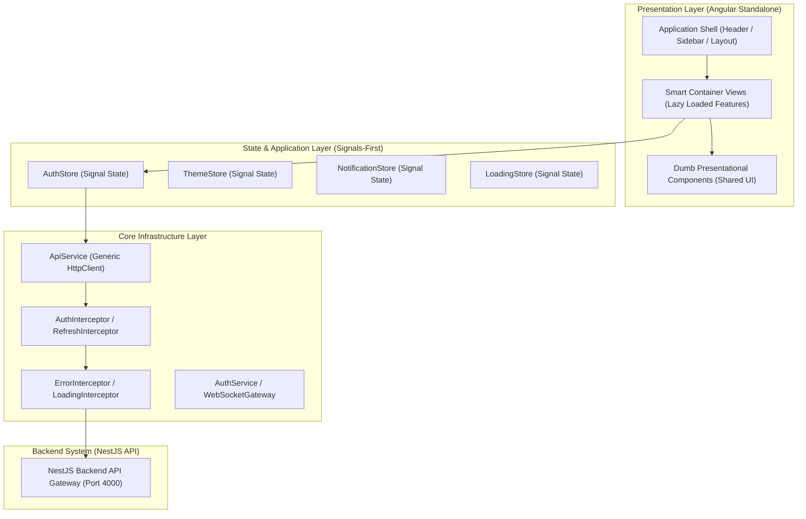

# 🏛️ Enterprise Frontend Architecture Specification (Angular Platform)

## 1. Executive System Topology
The **CodeLens Frontend Application** (`apps/frontend`) is built on **Angular (v17+) Standalone Architecture** and **Angular Signals**. Designed following Google, Microsoft, and Atlassian enterprise standards, the application decouples pure presentation components from asynchronous state management, HTTP networking, and business models.

### Key Architectural Pillars:
- **100% Standalone Architecture**: No `NgModules`. All components, directives, and pipes utilize Angular Standalone APIs. Application configuration is driven via `provideHttpClient()`, `provideRouter()`, `provideAnimationsAsync()`, and functional interceptors.
- **Signals-First Reactive State**: Global and feature states utilize native Angular `signal()`, `computed()`, and `effect()` primitives, minimizing RxJS boilerplate while preserving fine-grained change detection performance (`ChangeDetectionStrategy.OnPush`).
- **Clean Architecture & DDD Alignment**:
  - **Domain / Models**: Enterprise API contracts, JWT payload interfaces, and model enums synchronized with `@codelens/shared-dto`.
  - **Core Services**: Singleton HTTP wrappers, token storage adapters, WebSocket gateway clients, and logger services.
  - **State Store**: Reactive signal stores (`AuthStore`, `ThemeStore`, `NotificationStore`) encapsulating state mutations and side effects.
  - **Shared UI Layer**: Dumb presentational components (`cdl-button`, `cdl-card`, `cdl-loader`, `cdl-empty-state`) with zero business logic dependencies.

---

## 2. Layering Architecture Diagram

---

## 3. Smart vs. Dumb Component Standard

| Aspect | Smart Container Components | Dumb Presentational Components |
| :--- | :--- | :--- |
| **Primary Goal** | Orchestrates feature workflow, binds stores, dispatches API actions | Renders pristine UI, handles user input events |
| **Dependencies** | Injects Signal Stores, Router, Feature Services | Zero services; accepts Inputs, emits Outputs |
| **State Source** | Subscribes to Signal Stores & Router Param Signals | Reads read-only Inputs (`input()`, `@Input()`) |
| **Reusability** | Feature-specific, non-reusable | Highly reusable across entire application |
| **Location** | `src/app/features/*/containers` | `src/app/shared/components/*` |

---

## 4. Implementation Roadmap & Incremental Steps

1. ✅ **Step 1: Frontend Architecture** (Architecture Blueprint & Signal State Strategy)
2. 开启 **Step 2: Folder Structure** (Modular directory layout setup: `core`, `shared`, `layout`, `features`, `models`, `services`, `state`, `utils`, `config`)
3. ⏳ **Step 3: Environment Configuration** (Development, Testing, Production environment tokens & feature flags)
4. ⏳ **Step 4: Core Services** (Logger, Storage, Configuration, Theme, API primitives)
5. ⏳ **Step 5: HTTP Layer** (Generic `ApiService` wrapper, retry policies, request cancellation, timeout handling)
6. ⏳ **Step 6: Interceptors** (Auth, Refresh Token, Error, Loading, and Logging functional interceptors)
7. ⏳ **Step 7: Guards** (AuthGuard, GuestGuard, RoleGuard, PermissionGuard)
8. ⏳ **Step 8: Routing** (Lazy-loaded feature routes, route preloading strategy)
9. ⏳ **Step 9: Application Shell** (Responsive Shell Layout, Header, Sidebar, Footer, Router Outlet)
10. ⏳ **Step 10: Shared Components** (Buttons, Cards, Dialogs, Inputs, Tables, Loaders, Empty & Error States)
11. ⏳ **Step 11: State Management** (Angular Signal stores for User, Auth, Theme, Loading, Notifications)
12. ⏳ **Step 12: Theme System** (Dark, Light, System auto-detect, CSS Custom Properties & Material tokens)
13. ⏳ **Step 13: Backend Integration** (Connecting `/health`, `/users/me`, Authentication endpoints, WebSocket client)
14. ⏳ **Step 14: Testing Setup** (Component & Service testing utilities, Jasmine/Karma setup)
15. ⏳ **Step 15: Documentation** (Developer Guide, Folder Specs, Component Catalog)
