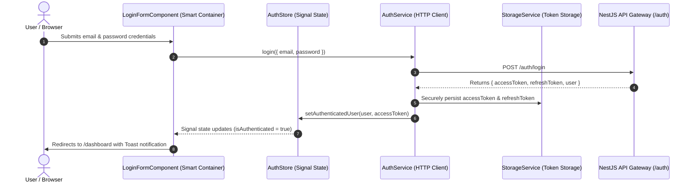
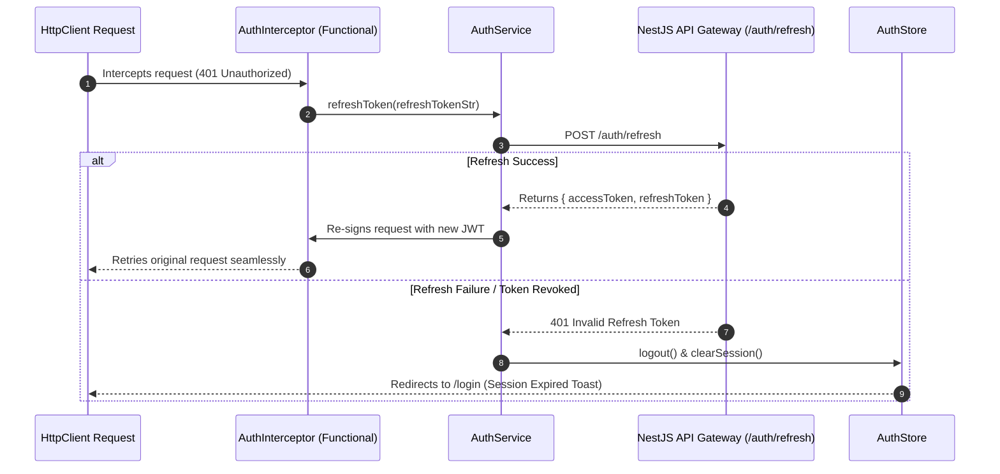

# 🔐 Phase F2 — Authentication & User Management Architecture Specification

## 1. Executive Authentication Topology
The **Authentication & User Management Module** (`apps/frontend/src/app/features/auth`) provides security infrastructure, session tracking, JWT lifecycle management, and user profile management for CodeLens.

Built with **Angular Standalone Components**, **Angular Signals**, and **Reactive Forms**, the module consumes NestJS authentication endpoints without modifying existing backend contracts.

---

## 2. Authentication Lifecycle & State Flow



---

## 3. Silent Refresh Token & Session Expiration Flow



---

## 4. Signal Auth Store Architecture (`AuthStore`)

```typescript
export interface AuthState {
  currentUser: UserProfile | null;
  accessToken: string | null;
  refreshToken: string | null;
  status: 'IDLE' | 'AUTHENTICATING' | 'AUTHENTICATED' | 'UNAUTHENTICATED' | 'ERROR';
  error: string | null;
}
```

### Derived Computed Signals:
- `isAuthenticated`: `computed(() => !!state.currentUser() && !!state.accessToken())`
- `roles`: `computed(() => state.currentUser()?.role || Role.USER)`
- `isAdmin`: `computed(() => state.currentUser()?.role === Role.ADMIN || state.currentUser()?.role === Role.SUPER_ADMIN)`
- `userFullName`: `computed(() => state.currentUser()?.name || state.currentUser()?.email || 'User')`
- `userInitials`: `computed(() => getUserInitials(state.currentUser()))`

---

## 5. Authorization & Route Guards Matrix

| Route Guard | Target Routes | Protection Behavior |
| :--- | :--- | :--- |
| **`AuthGuard`** | `/dashboard`, `/review/*`, `/chat`, `/reports`, `/profile`, `/settings` | Blocks unauthenticated users -> Redirects to `/login?returnUrl=...` |
| **`GuestGuard`** | `/login`, `/register`, `/forgot-password`, `/reset-password` | Blocks authenticated users -> Redirects to `/dashboard` |
| **`RoleGuard`** | `/admin/*` | Validates `role` array (`SUPER_ADMIN`, `ADMIN`) -> Redirects to `403 Forbidden` if unauthorized |
| **`PermissionGuard`**| Granular admin operations | Validates specific permission strings -> Blocks unauthorized actions |

---

## 6. Incremental Step Roadmap for Phase F2

1. ✅ **Step 1: Authentication Architecture** (Architecture Blueprint & Signal Auth Flow)
2. 开启 **Step 2: Folder Structure** (Creating auth feature, models, services, components, pages)
3. ⏳ **Step 3: Authentication Models** (TypeScript DTO interfaces for Login, Register, User, JWT)
4. ⏳ **Step 4: Authentication Services** (AuthService, TokenStorageService, UserProfileService)
5. ⏳ **Step 5: Authentication State** (Signal-based `AuthStore`)
6. ⏳ **Step 6: Login Page & Components** (`LoginFormComponent`, `/login` page)
7. ⏳ **Step 7: Registration Page & Components** (`RegisterFormComponent`, `/register` page)
8. ⏳ **Step 8: Forgot/Reset Password** (`/forgot-password`, `/reset-password` pages)
9. ⏳ **Step 9: Profile Pages** (`/profile`, `/edit-profile`, `/change-password` pages)
10. ⏳ **Step 10: Session Management** (Auto-login, Session Warning Dialog, Token Refresh)
11. ⏳ **Step 11: Guards** (AuthGuard, GuestGuard, RoleGuard, PermissionGuard)
12. ⏳ **Step 12: Backend Integration** (Connecting NestJS endpoints & error mapping)
13. ⏳ **Step 13: Testing** (Unit & Integration tests for AuthStore and AuthService)
14. ⏳ **Step 14: Documentation** (Feature README & Security guidelines)
