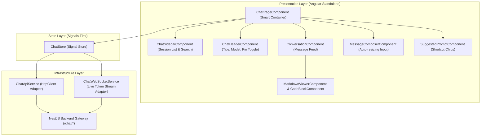

# 💬 Phase F6 — AI Chat Assistant UI Architecture Specification

## 1. Executive AI Chat Topology
The **AI Chat Assistant UI Module** (`apps/frontend/src/app/features/chat`) provides an enterprise-grade AI pair programmer interface (similar to Cursor / Claude Code / GitHub Copilot).

It enables developers to converse with AI models about code reviews, query refactoring strategies, inspect security flaws, and request unit test generation with automatic context awareness.

---

## 2. Chat Data Pipeline & Signal Store Flow



---

## 3. Signal Chat Store Architecture (`ChatStore`)

```typescript
export interface ChatSession {
  id: string;
  title: string;
  reviewId: string | null;
  aiProvider: string;
  isPinned: boolean;
  messageCount: number;
  lastMessageAt: Date;
  createdAt: Date;
}

export interface ChatMessage {
  id: string;
  sessionId: string;
  sender: 'USER' | 'ASSISTANT' | 'SYSTEM';
  content: string;
  codeSnippet?: string | null;
  tokensUsed?: number;
  createdAt: Date;
}

export interface ChatState {
  sessions: ChatSession[];
  activeSessionId: string | null;
  messages: ChatMessage[];
  suggestedPrompts: SuggestedPrompt[];
  isStreaming: boolean;
  isTyping: boolean;
  searchQuery: string;
  isLoadingSessions: boolean;
  isLoadingMessages: boolean;
  error: string | null;
}
```

### Derived Computed Signals:
- `activeSession`: `computed(() => state.sessions().find(s => s.id === state.activeSessionId()) || null)`
- `pinnedSessions`: `computed(() => state.sessions().filter(s => s.isPinned))`
- `filteredSessions`: `computed(() => filterSessions(state.sessions(), state.searchQuery()))`
- `hasActiveSession`: `computed(() => !!state.activeSessionId())`
- `messageCount`: `computed(() => state.messages().length)`

---

## 4. Component Hierarchy & Smart/Dumb Separation

| Component Name | Role | Inputs (`input()`) | Outputs (`output()`) | Description |
| :--- | :--- | :--- | :--- | :--- |
| **`ChatPageComponent`** | Smart Container | None | None | Injects `ChatStore`, manages route params (`sessionId`, `reviewId`), triggers API calls |
| **`ChatSidebarComponent`** | Dumb Component | `sessions`, `pinnedSessions`, `activeSessionId`, `searchQuery` | `sessionSelected`, `sessionCreated`, `sessionRenamed`, `sessionDeleted`, `pinToggled` | Sidebar list of conversations with search filter |
| **`ChatHeaderComponent`** | Dumb Component | `session`, `isStreaming` | `titleUpdated`, `pinToggled`, `newChatClicked` | Header bar showing active chat title, model, and context chip |
| **`ConversationComponent`** | Dumb Component | `messages`, `isStreaming`, `isTyping` | `copyClicked`, `regenerateClicked` | Scrollable chat log rendering message bubbles & streaming state |
| **`MessageComponent`** | Dumb Component | `message` | `copyClicked` | Message item distinguishing User vs AI Assistant bubbles |
| **`MessageComposerComponent`**| Dumb Component | `isStreaming`, `disabled` | `messageSent`, `streamStopped` | Textarea input with auto-expand, send button & keyboard shortcuts |
| **`MarkdownViewerComponent`** | Dumb Component | `content` | `codeCopied` | Safe HTML markdown parser rendering code blocks, tables, and lists |
| **`CodeBlockComponent`** | Dumb Component | `code`, `language` | `copied` | Syntax-highlighted code block container with copy button |
| **`SuggestedPromptComponent`**| Dumb Component | `prompts` | `promptSelected` | Contextual prompt chips ("Explain code", "Optimize", "Add unit tests") |

---

## 5. Incremental Step Roadmap for Phase F6

1. ✅ **Step 1: Chat Architecture** (Architecture Blueprint & Signal Store)
2. 开启 **Step 2: Folder Structure** (Creating `features/chat` directory structure)
3. ⏳ **Step 3: Models** (TypeScript interfaces matching NestJS Chat DTOs)
4. ⏳ **Step 4: Services** (ChatApiService HTTP & ChatWebSocketService integration)
5. ⏳ **Step 5: Chat Layout** (`ChatLayoutComponent` IDE flex layout)
6. ⏳ **Step 6: Session Management** (`ChatSidebarComponent` & `ChatHeaderComponent`)
7. ⏳ **Step 7: Conversation UI** (`ConversationComponent` & `MessageComponent`)
8. ⏳ **Step 8: Message Composer** (`MessageComposerComponent` input control)
9. ⏳ **Step 9: Streaming Integration** (WebSocket live token completion listener)
10. ⏳ **Step 10: Markdown & Code Rendering** (`MarkdownViewerComponent` & `CodeBlockComponent`)
11. ⏳ **Step 11: Suggested Prompts** (`SuggestedPromptComponent` chips)
12. ⏳ **Step 12: Backend Integration** (Connecting NestJS REST APIs & review context injection)
13. ⏳ **Step 13: Testing** (Unit & Integration tests for ChatStore and Markdown parsing)
14. ⏳ **Step 14: Documentation** (Feature README & AI Chat specification)
