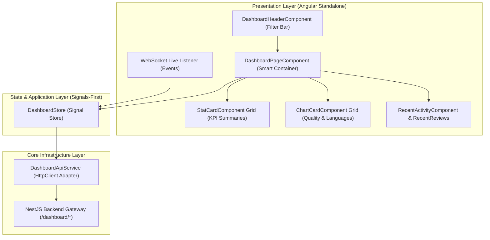

# 📊 Phase F3 — Dashboard & Analytics Architecture Specification

## 1. Executive Dashboard Topology
The **Dashboard & Analytics Module** (`apps/frontend/src/app/features/dashboard`) provides executive KPI metrics, code review quality trends, programming language breakdowns, AI provider utilization, activity timelines, and live notification feeds.

Built with **Angular Standalone Components**, **Angular Signals**, and **OnPush Change Detection**, the module connects directly to the NestJS backend endpoints without mock data.

---

## 2. Dashboard Data Pipeline & Signal Store Flow



---

## 3. Signal Dashboard Store Architecture (`DashboardStore`)

```typescript
export interface DashboardFilterState {
  days: number;
  language: string | null;
  status: string | null;
  provider: string | null;
}

export interface DashboardState {
  summary: UserDashboardSummaryResponseDto | null;
  qualityTrend: QualityTrendPointDto[];
  languageStats: LanguageDistributionDto[];
  providerUsage: ProviderUsageStatDto[];
  recentActivity: ActivityTimelineItemDto[];
  filterState: DashboardFilterState;
  isLoading: boolean;
  error: string | null;
  lastUpdated: Date | null;
}
```

### Derived Computed Signals:
- `hasData`: `computed(() => !!state.summary())`
- `topLanguage`: `computed(() => state.languageStats()[0]?.language || 'N/A')`
- `averageQualityScore`: `computed(() => state.summary()?.avgQualityScore || 0)`
- `qualityBadgeColor`: `computed(() => getQualityBadgeColor(state.summary()?.avgQualityScore))`
- `totalReviews`: `computed(() => state.summary()?.totalReviews || 0)`

---

## 4. Component Hierarchy & Smart/Dumb Separation

| Component Name | Role | Inputs (`input()`) | Outputs (`output()`) | Description |
| :--- | :--- | :--- | :--- | :--- |
| **`DashboardPageComponent`** | Smart Container | None | None | Injects `DashboardStore`, manages filtering, handles quick actions |
| **`DashboardHeaderComponent`**| Dumb Component | `filterState`, `user` | `filterChanged`, `refreshClicked` | Header title, date range picker, language/provider filters |
| **`StatCardComponent`** | Dumb Component | `title`, `value`, `icon`, `trend` | `cardClicked` | Displays single KPI metric card with icon & trend indicator |
| **`ChartCardComponent`** | Dumb Component | `title`, `type`, `data`, `loading` | `legendClicked` | Responsive chart container (Quality Trend, Language Pie) |
| **`RecentReviewsComponent`** | Dumb Component | `reviews`, `loading` | `reviewSelected` | Interactive table/list of recent code reviews with quick actions |
| **`RecentActivityComponent`**| Dumb Component | `activities`, `loading` | `activityClicked` | Timeline of review completion, chat, and report generation events |
| **`NotificationPanelComponent`**| Dumb Component | `notifications` | `notificationRead` | Unread notifications drawer with live WebSocket updates |
| **`QuickActionsComponent`** | Dumb Component | None | `actionTriggered` | Quick action buttons ("New Review", "Upload File", "AI Chat") |

---

## 5. Incremental Step Roadmap for Phase F3

1. ✅ **Step 1: Dashboard Architecture** (Architecture Blueprint & Signal Pipeline)
2. 开启 **Step 2: Folder Structure** (Creating `features/dashboard` directory structure)
3. ⏳ **Step 3: Dashboard Models** (TypeScript interfaces matching NestJS DTOs)
4. ⏳ **Step 4: Dashboard Services** (DashboardApiService HTTP integration)
5. ⏳ **Step 5: Dashboard State (Signals)** (Signal-based `DashboardStore`)
6. ⏳ **Step 6: Summary Cards Component** (`StatCardComponent` grid implementation)
7. ⏳ **Step 7: Charts Component** (`ChartCardComponent` Quality & Language charts)
8. ⏳ **Step 8: Recent Reviews Component** (`RecentReviewsComponent` data table)
9. ⏳ **Step 9: Activity Timeline Component** (`RecentActivityComponent` feed)
10. ⏳ **Step 10: Notifications Panel** (`NotificationPanelComponent` dropdown)
11. ⏳ **Step 11: WebSocket Integration** (Live event updates for completed reviews)
12. ⏳ **Step 12: Responsive Layout** (`DashboardLayoutComponent` grid container)
13. ⏳ **Step 13: Testing** (Unit & Integration tests for DashboardStore)
14. ⏳ **Step 14: Documentation** (Feature README & Component specification)
