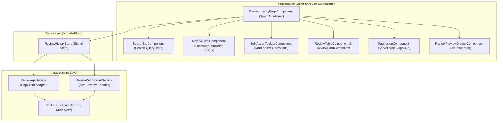

# 📜 Phase F7 — Review History & Management Architecture Specification

## 1. Executive Review History Topology
The **Review History & Review Management UI Module** (`apps/frontend/src/app/features/history`) provides an enterprise-grade review management portal (styled like GitHub Pull Requests, SonarQube Projects, and Azure DevOps Pipelines).

It enables developers and team leads to search, filter, preview, favorite, re-run, bulk delete, and export all historical AI code reviews.

---

## 2. Data Pipeline & Signal Store Flow



---

## 3. Signal Review History Store Architecture (`ReviewHistoryStore`)

```typescript
export interface ReviewListItem {
  id: string;
  title: string;
  description: string | null;
  repository: string | null;
  branch: string | null;
  status: 'PENDING' | 'QUEUED' | 'PROCESSING' | 'COMPLETED' | 'FAILED' | 'CANCELLED';
  score: number | null;
  summary: string | null;
  timeComplexity: string | null;
  spaceComplexity: string | null;
  aiProvider: string;
  aiModel: string | null;
  processingTimeMs: number | null;
  isFavorited: boolean;
  fileCount: number;
  totalIssuesCount: number;
  criticalIssuesCount: number;
  createdAt: Date;
  updatedAt: Date;
}

export interface ReviewHistoryFilterState {
  searchQuery: string;
  status: string | 'ALL';
  language: string | 'ALL';
  aiProvider: string | 'ALL';
  favoritesOnly: boolean;
  sortBy: 'createdAt' | 'score' | 'title';
  sortOrder: 'asc' | 'desc';
  skip: number;
  take: number;
}

export interface ReviewHistoryState {
  reviews: ReviewListItem[];
  totalCount: number;
  filters: ReviewHistoryFilterState;
  selectedIds: Set<string>;
  previewReviewId: string | null;
  viewMode: 'table' | 'cards';
  isLoading: boolean;
  isBulkProcessing: boolean;
  error: string | null;
}
```

### Derived Computed Signals:
- `currentPage`: `computed(() => Math.floor(state.filters().skip / state.filters().take) + 1)`
- `totalPages`: `computed(() => Math.ceil(state.totalCount() / state.filters().take))`
- `selectedCount`: `computed(() => state.selectedIds().size)`
- `hasSelected`: `computed(() => state.selectedIds().size > 0)`
- `isAllSelected`: `computed(() => state.reviews().length > 0 && state.reviews().every(r => state.selectedIds().has(r.id)))`
- `activePreview`: `computed(() => state.reviews().find(r => r.id === state.previewReviewId()) || null)`

---

## 4. Component Hierarchy & Smart/Dumb Separation

| Component Name | Role | Inputs (`input()`) | Outputs (`output()`) | Description |
| :--- | :--- | :--- | :--- | :--- |
| **`ReviewHistoryPageComponent`** | Smart Container | None | None | Injects `ReviewHistoryStore`, manages query parameters, dispatches actions |
| **`SearchBarComponent`** | Dumb Component | `query` | `queryChanged` | Search text box with 300ms debounced auto-submit |
| **`ReviewFilterComponent`** | Dumb Component | `filters`, `activeCount` | `filterChanged`, `resetClicked` | Filter bar dropdowns for Status, Language, AI Provider, Favorites |
| **`BulkActionToolbarComponent`** | Dumb Component | `selectedCount`, `totalCount` | `bulkFavorite`, `bulkDelete`, `bulkExport`, `clearSelection` | Action toolbar shown when 1+ rows are checked |
| **`ReviewTableComponent`** | Dumb Component | `reviews`, `selectedIds`, `activePreviewId` | `rowClicked`, `selectionToggled`, `favoriteToggled`, `rerunClicked`, `deleteClicked` | Enterprise tabular view displaying status badge, grade, score, & date |
| **`ReviewCardComponent`** | Dumb Component | `review`, `isSelected` | `cardClicked`, `favoriteToggled`, `rerunClicked` | Responsive grid card alternative to table layout |
| **`ReviewPreviewDrawerComponent`**| Dumb Component | `review` | `closeDrawer`, `openFullReview`, `rerun` | Side sheet preview showing summary, bug counts & Big-O complexity |
| **`PaginationComponent`** | Dumb Component | `currentPage`, `totalPages`, `pageSize`, `totalCount` | `pageChanged`, `pageSizeChanged` | Page size & page step navigation controls |

---

## 5. Incremental Step Roadmap for Phase F7

1. ✅ **Step 1: History Architecture** (Architecture Blueprint & Signal Store)
2. 开启 **Step 2: Folder Structure** (Creating `features/history` directory structure)
3. ⏳ **Step 3: Models** (TypeScript interfaces matching NestJS List Reviews DTOs)
4. ⏳ **Step 4: Services** (ReviewHistoryApiService HTTP integration)
5. ⏳ **Step 5: History Page** (`ReviewHistoryPageComponent` layout)
6. ⏳ **Step 6: Filters & Search** (`ReviewFilterComponent` & `SearchBarComponent`)
7. ⏳ **Step 7: Table / Cards** (`ReviewTableComponent` & `ReviewCardComponent`)
8. ⏳ **Step 8: Bulk Actions** (`BulkActionToolbarComponent` multi-select actions)
9. ⏳ **Step 9: Pagination** (`PaginationComponent` server-side page navigation)
10. ⏳ **Step 10: Review Preview** (`ReviewPreviewDrawerComponent` side inspection)
11. ⏳ **Step 11: Backend Integration** (Connecting NestJS REST APIs & report downloads)
12. ⏳ **Step 12: WebSocket Updates** (Live review status listener)
13. ⏳ **Step 13: Testing** (Unit & Integration tests for HistoryStore)
14. ⏳ **Step 14: Documentation** (Feature README & Management guide)
