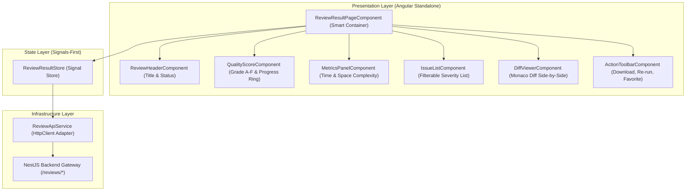

# 🔍 Phase F5 — AI Review Results & Code Analysis UI Architecture Specification

## 1. Executive Review Results Topology
The **AI Review Results & Code Analysis UI Module** (`apps/frontend/src/app/features/reviews`) visualizes every dimension of AI code analysis: overall quality scores (Grades A–F), time/space complexity metrics, severity-grouped code issues, actionable AI recommendations, and side-by-side/inline code diffs.

Built with **Angular Standalone Components**, **Monaco Diff Editor**, **Angular Signals**, and **OnPush Change Detection**, the page connects to NestJS backend REST APIs.

---

## 2. Review Results Data Pipeline & Signal Store Flow



---

## 3. Signal Review Result Store Architecture (`ReviewResultStore`)

```typescript
export type QualityGrade = 'A+' | 'A' | 'B' | 'C' | 'D' | 'F';

export interface ReviewResultState {
  reviewId: string | null;
  review: ReviewDetailDto | null;
  isFavorited: boolean;
  activeFileId: string | null;
  selectedSeverity: Severity | 'ALL';
  diffMode: 'side-by-side' | 'inline';
  isLoading: boolean;
  isRerunning: boolean;
  error: string | null;
}
```

### Derived Computed Signals:
- `score`: `computed(() => state.review()?.score ?? 0)`
- `grade`: `computed(() => calculateGrade(state.review()?.score))`
- `gradeColor`: `computed(() => getGradeColor(calculateGrade(state.review()?.score)))`
- `issues`: `computed(() => state.review()?.files.flatMap(f => f.issues) || [])`
- `criticalCount`: `computed(() => state.issues().filter(i => i.severity === 'CRITICAL').length)`
- `filteredIssues`: `computed(() => filterIssuesBySeverity(state.issues(), state.selectedSeverity()))`
- `activeFile`: `computed(() => state.review()?.files.find(f => f.id === state.activeFileId()) || state.review()?.files[0] || null)`

---

## 4. Component Hierarchy & Smart/Dumb Separation

| Component Name | Role | Inputs (`input()`) | Outputs (`output()`) | Description |
| :--- | :--- | :--- | :--- | :--- |
| **`ReviewResultPageComponent`** | Smart Container | None | None | Injects `ReviewResultStore`, handles page routing & action dispatches |
| **`ReviewHeaderComponent`** | Dumb Component | `review`, `isFavorited` | `favoriteToggled`, `rerunTriggered` | Header banner with title, repository, status chip, and breadcrumb |
| **`QualityScoreComponent`** | Dumb Component | `score`, `grade`, `gradeColor` | None | Progress ring visualizing overall score & letter grade |
| **`MetricsPanelComponent`** | Dumb Component | `timeComplexity`, `spaceComplexity`, `processingTimeMs` | None | Cards displaying Big-O complexity & AI latency |
| **`IssueListComponent`** | Dumb Component | `issues`, `selectedSeverity` | `severityChanged`, `issueSelected` | Grouped list of code issues with severity tabs |
| **`IssueCardComponent`** | Dumb Component | `issue` | `applyFixClicked` | Single issue item with line number, badge, description, and suggested fix |
| **`DiffViewerComponent`** | Dumb Component | `originalCode`, `improvedCode`, `filename`, `language`, `diffMode` | `modeToggled` | Side-by-side or inline Monaco Diff Editor instance |
| **`ActionToolbarComponent`**| Dumb Component | `reviewId`, `isFavorited` | `copyFeedback`, `downloadReport`, `rerun`, `favorite` | Floating or header action bar for exports & operations |

---

## 5. Incremental Step Roadmap for Phase F5

1. ✅ **Step 1: Review Results Architecture** (Architecture Blueprint & Signal Store)
2. 开启 **Step 2: Folder Structure** (Creating `features/reviews` directory structure)
3. ⏳ **Step 3: Models** (TypeScript interfaces matching NestJS Review response DTOs)
4. ⏳ **Step 4: Services** (ReviewApiService HTTP integration)
5. ⏳ **Step 5: Review Summary** (`ReviewHeaderComponent` implementation)
6. ⏳ **Step 6: Quality Score** (`QualityScoreComponent` with progress ring & grade)
7. ⏳ **Step 7: Metrics** (`MetricsPanelComponent` time & space complexity)
8. ⏳ **Step 8: Issue Panels** (`IssueListComponent` & `IssueCardComponent`)
9. ⏳ **Step 9: Recommendations** (`RecommendationPanelComponent` best practices)
10. ⏳ **Step 10: Diff Viewer** (`DiffViewerComponent` side-by-side Monaco diff)
11. ⏳ **Step 11: Action Toolbar** (`ActionToolbarComponent` export & favorite triggers)
12. ⏳ **Step 12: Backend Integration** (Connecting NestJS endpoints & report downloads)
13. ⏳ **Step 13: Testing** (Unit & Integration tests for ReviewResultStore)
14. ⏳ **Step 14: Documentation** (Feature README & Component guide)
