# 🏛️ Phase F8 — Reports & Export System Architecture Specification

## 1. System Overview & Scope
The **Reports & Export Module** in CodeLens provides enterprise team leads, security auditors, and developers with comprehensive reporting, multi-format exports (PDF, Markdown, JSON, CSV), browser print optimization, and tokenized report sharing. Inspired by GitHub Enterprise, SonarQube Cloud, and Azure DevOps reporting suites, this module is built using **Angular 20**, **Signals-first reactive state management**, and **Clean Architecture**.

---

## 2. Architectural Blueprint & Component Topology

```mermaid
graph TD
    subgraph "Presentation Layer (Smart / Dumb Components)"
        RPC["ReportsPageComponent (Smart Container)"]
        
        RPC --> RTC["ReportToolbarComponent (Dumb)"]
        RPC --> RSC["ReportSearchComponent (Dumb)"]
        RPC --> RFC["ReportFilterComponent (Dumb)"]
        RPC --> RTSC["ReportTemplateSelectorComponent (Dumb)"]
        RPC --> RCC["ReportCardComponent (Dumb Grid/List)"]
        RPC --> RVC["ReportViewerComponent (Dumb Detail)"]
        RPC --> EMC["ExportMenuComponent (Dumb Action)"]
        RPC --> PPC["PrintPreviewComponent (Dumb Modal)"]
        RPC --> SDC["ShareDialogComponent (Dumb Modal)"]
    end

    subgraph "Application State Layer (Signals Store)"
        Store["ReportsStore / Signals State"]
        Store --> SigReports["reports: Signal<ReportSummary[]>"]
        Store --> SigCurrent["currentReport: Signal<ReportDetail | null>"]
        Store --> SigFilters["filters: Signal<ReportFilterCriteria>"]
        Store --> SigLoading["loading: Signal<boolean>"]
        Store --> SigShare["shareState: Signal<ShareState>"]
    end

    subgraph "Infrastructure & Service Layer"
        Service["ReportsService"]
        Service --> Http["HttpClient (NestJS Backend API)"]
        Service --> ExportUtil["ExportDownloadAdapter"]
        Service --> PrintUtil["PrintPreviewEngine"]
    end

    RPC --> Store
    Store --> Service
```

---

## 3. SOLID & Clean Architecture Principles

1. **Single Responsibility Principle (SRP)**:
   - Components focus strictly on visual representation and user interactions.
   - `ReportsService` handles HTTP transport and API adaptations.
   - `ExportDownloadAdapter` manages file Blob extraction and browser triggers.
2. **Open/Closed Principle (OCP)**:
   - Exporter utilities are extensible to support new file types (e.g. HTML, DOCX) without modifying viewer or container logic.
3. **Liskov Substitution Principle (LSP)**:
   - Data models strictly implement common contracts (`ReportSummary`, `ReportDetail`, `ReportTemplate`).
4. **Interface Segregation Principle (ISP)**:
   - Specific contracts exist for search/filter events, export options, and sharing tokens.
5. **Dependency Inversion Principle (DIP)**:
   - UI components rely on reactive Signal contracts and abstract service methods rather than raw HTTP primitives.

---

## 4. State Management Strategy (Angular Signals)

State is managed using Angular 20 Signals for granular reactivity without zone overhead:

- **State Signals**:
  - `reports = signal<ReportSummary[]>([])`
  - `currentReport = signal<ReportDetail | null>(null)`
  - `templates = signal<ReportTemplate[]>([])`
  - `filters = signal<ReportFilterCriteria>({})`
  - `searchTerm = signal<string>('')`
  - `isLoading = signal<boolean>(false)`
  - `activeModal = signal<'export' | 'print' | 'share' | 'generate' | null>(null)`

- **Computed Signals**:
  - `filteredReports = computed(() => ...)`: Dynamically filters list based on `searchTerm`, `type`, `format`, `dateRange`, `sharedStatus`.
  - `executiveSummaryStats = computed(() => ...)`: Aggregates quality scores, bug counts, and recommendation density for dashboard widgets.
  - `isShareActive = computed(() => ...)`: Evaluates token validity and expiration.

---

## 5. Subsystems & Core Capabilities

### A. Reports Dashboard & Viewer
- High-level KPIs: Total Reports, Passed Reviews, Critical Vulnerabilities, Average Quality Score.
- Detailed viewer sections: Executive Summary, Metadata, Quality Score, AI Analysis, Bug Matrix, Recommendations, Complexity Analysis, Improved Code snippets, and Visual Charts.

### B. Multi-Format Exporter
- Native file downloads via backend binary streams or client-side fallback adapters:
  - **PDF**: Styled layout with clean typography, page breaks, and embedded code blocks.
  - **Markdown**: GFM-compliant markdown with tables and code fences.
  - **JSON**: Structured API payload for programmatic analysis.
  - **CSV**: Spreadsheet-compatible issue matrix export.

### C. Print Subsystem
- Optimized CSS media queries (`@media print`) hiding sidebars, navigation, and actions while re-styling code snippets, charts, and page breaks.
- Dedicated `PrintPreviewComponent` for layout customization before browser print triggering (`window.print()`).

### D. Security & Link Sharing Subsystem
- Public tokenized link generation with configurable expiration dates (24h, 7d, 30d, Never).
- One-click share link copying with toast notification feedback.
- Granular revocation capability (`DELETE /reports/share/:token`).
- Safe HTML parsing using Angular `DomSanitizer` to prevent XSS.

---

## 6. Backend Integration Endpoints

| Method | Endpoint | Description |
| :--- | :--- | :--- |
| `POST` | `/reports/generate` | Generates a report from review ID and template |
| `GET` | `/reports` | Retrieves filtered list of user reports |
| `GET` | `/reports/:id` | Retrieves full report details by ID |
| `GET` | `/reports/:id/pdf` | Downloads report in PDF format |
| `GET` | `/reports/:id/markdown` | Downloads report in Markdown format |
| `GET` | `/reports/:id/json` | Downloads report in JSON format |
| `GET` | `/reports/:id/csv` | Downloads report in CSV format |
| `POST` | `/reports/:id/share` | Creates a shared link with token and expiration |
| `DELETE` | `/reports/share/:token` | Revokes shared access token |
| `GET` | `/reports/share/:token` | Retrieves public shared report by token |

---

## 7. Next Steps in Execution Plan

- **Step 2**: Folder Structure Setup
- **Step 3**: TypeScript Interfaces & Models
- **Step 4**: ReportsService & Signal State
- **Step 5**: Reports Dashboard Component
- **Step 6**: Report Viewer & Section Components
- **Step 7**: Export Functionality
- **Step 8**: Print Preview & Media CSS
- **Step 9**: Secure Link Sharing Dialog & Revocation
- **Step 10**: Filters, Search, & Template Selector
- **Step 11**: Backend Integration Verification
- **Step 12**: Unit & Component Tests
- **Step 13**: Architectural Documentation & Artifact Summary
