# 🏛️ Phase F9 — Settings & User Preferences System Architecture Specification

## 1. System Overview & Scope
The **Settings & User Preferences Module** in CodeLens provides enterprise developers, team leads, and administrators with a comprehensive configuration hub for account settings, application preferences, visual appearance, code editor behavior, AI parameters, notification channels, security & sessions, privacy controls, and API access keys.

Inspired by GitHub Enterprise, VS Code Settings, Azure DevOps, and Notion, this module is built using **Angular 20**, **Signals-first reactive state management**, **Angular Material**, **SCSS**, and **Clean Architecture**.

---

## 2. Architectural Blueprint & Component Topology

```mermaid
graph TD
    subgraph "Presentation Layer (Smart / Dumb Components)"
        SLC["SettingsLayoutComponent (Smart Container / Page Shell)"]
        SSC["SettingsSidebarComponent (Dumb Navigation)"]
        SEC["SettingsSectionComponent (Dumb Section Wrapper)"]
        PCC["PreferenceCardComponent (Dumb Setting Control)"]
        
        SLC --> SSC
        SLC --> SEC
        
        SLC --> GSC["GeneralSettingsComponent (Smart / Dumb)"]
        SLC --> TSC["ThemeSelectorComponent (Appearance)"]
        SLC --> ESC["EditorSettingsComponent (Editor Preferences)"]
        SLC --> ASC["AISettingsComponent (AI Preferences)"]
        SLC --> NSC["NotificationSettingsComponent (Notifications)"]
        SLC --> SEC_C["SecuritySettingsComponent (Security & 2FA)"]
        SLC --> STC["SessionTableComponent (Active Sessions)"]
        SLC --> PSC["PrivacySettingsComponent (Privacy & Data)"]
        SLC --> ATC["ApiKeyTableComponent (API Key Management)"]
        SLC --> ABC["AboutSettingsComponent (System Info)"]

        SEC_C --> STC
        GSC --> SEC
        TSC --> PCC
        ESC --> PCC
        ASC --> PCC
        NSC --> PCC
        PSC --> PCC
    end

    subgraph "Application State & Data Layer (Signals Store)"
        Store["SettingsStore / SettingsState (Signals Service)"]
        Store --> SigGen["userProfile: Signal<UserProfile>"]
        Store --> SigApp["appSettings: Signal<UserSettings>"]
        Store --> SigTheme["activeTheme: Signal<'light' | 'dark' | 'system'>"]
        Store --> SigSessions["sessions: Signal<UserSession[]>"]
        Store --> SigApiKeys["apiKeys: Signal<ApiKey[]>"]
        Store --> SigLoading["loading: Signal<boolean>"]
        Store --> SigSaveStatus["saveStatus: Signal<'idle' | 'saving' | 'saved' | 'error'>"]
    end

    subgraph "Infrastructure & Service Layer"
        Service["SettingsService"]
        Service --> Http["HttpClient (NestJS Backend REST APIs)"]
        Service --> LocalStorage["LocalStorageAdapter (Offline Theme & Editor Cache)"]
        Service --> ThemeEngine["ThemeManagerService (DOM Class & CSS Variables)"]
    end

    SLC --> Store
    Store --> Service
```

---

## 3. SOLID & Clean Architecture Principles

1. **Single Responsibility Principle (SRP)**:
   - Components handle UI rendering and user inputs for specific configuration categories.
   - `SettingsService` handles HTTP transport, API response mapping, and request caching.
   - `ThemeManagerService` manages DOM stylesheet switching, high-contrast modes, and OS color scheme listeners.
2. **Open/Closed Principle (OCP)**:
   - Settings sections are modularized and decoupled, allowing addition of new preference sections without altering core navigation or layout.
3. **Liskov Substitution Principle (LSP)**:
   - All setting controls adhere to unified Angular Reactive Forms and Signal input/output contracts.
4. **Interface Segregation Principle (ISP)**:
   - Interfaces are split into granular domains (`GeneralPreferences`, `AppearancePreferences`, `EditorPreferences`, `AIPreferences`, `NotificationPreferences`, `SecurityState`, `PrivacyPreferences`, `ApiKey`).
5. **Dependency Inversion Principle (DIP)**:
   - UI views interact with high-level `SettingsStore` / `SettingsService` signals rather than calling raw API endpoints directly.

---

## 4. State Management Strategy (Angular Signals)

The module utilizes Angular 20 Signals to manage user configuration state reactively without zone-change detection overhead:

- **Core Signals**:
  - `profile = signal<UserProfile | null>(null)`
  - `preferences = signal<UserPreferences>(DEFAULT_USER_PREFERENCES)`
  - `sessions = signal<UserSession[]>([])`
  - `apiKeys = signal<ApiKey[]>([])`
  - `activeSection = signal<SettingsSection>('general')`
  - `isDirty = signal<boolean>(false)`
  - `isLoading = signal<boolean>(false)`

- **Computed Signals**:
  - `effectiveTheme = computed(() => ...)`: Resolves system default preference vs explicitly set light/dark theme.
  - `isSaving = computed(() => ...)`: Derives pending API mutation states.
  - `activeSessionCount = computed(() => ...)`: Returns count of currently active devices/sessions.
  - `hasExpiredApiKeys = computed(() => ...)`: Identifies keys requiring renewal.

---

## 5. Settings Subsystems & Requirements Breakdown

### A. General Settings
- User Profile: Display Name, Username, Email address.
- Localization: Time Zone selector, Language dropdown (English, Spanish, French, German, Japanese, Chinese), Date Format (`YYYY-MM-DD`, `MM/DD/YYYY`, `DD/MM/YYYY`), Time Format (`12-hour`, `24-hour`).

### B. Appearance Settings
- Theme Modes: Light, Dark, System preference with auto-switch.
- Display Options: Global font size (Small, Medium, Large), Editor font family, Editor theme (VS-Dark, One Dark, GitHub Dark/Light), Compact layout toggle.

### C. Editor Preferences
- Code Viewport: Word wrap (On/Off/WordWrapColumn), Minimap visibility, Line numbers (On/Off/Relative), Tab size (2, 4, 8 spaces), Font family & size, Auto-save (Off, After Delay, On Focus Change), Default language mode.

### D. AI Preferences
- Provider & Model Selection: Default AI Provider (Gemini, OpenAI, Anthropic), Default AI Model (Gemini 2.5 Flash, Gemini 2.5 Pro, GPT-4o, Claude 3.5 Sonnet).
- Generation Parameters: Response Detail Level (Concise, Balanced, Exhaustive), Preferred Explanation Style (Architectural, Security-First, Code-Only, Step-by-Step), Streaming Responses toggle, Auto-Analyze on PR creation toggle, Temperature slider (0.0 to 1.0), Max Tokens limit (512 to 8192).

### E. Notification Settings
- Delivery Channels: Email Notifications, In-App Notifications.
- Event Triggers: Review Completed, Report Generated, AI Chat Updates, Security Alerts, Marketing/Product Updates.

### F. Security Settings
- Credentials: Change Password form with strength meter & verification.
- Active Sessions: Session table showing OS, browser, IP address, location, last active timestamp, current device badge, and "Logout Session" / "Logout All Other Devices" actions.
- Multi-Factor Auth: 2FA state toggle UI, QR code setup modal stub, recovery codes display.
- Audit & Security: Login History & Connected Devices log.

### G. Privacy Settings
- Access & Visibility: Profile Visibility (Public, Organization, Private), Share Reports by Default toggle, Anonymous Analytics Participation toggle.
- Data Ownership: Request Personal Data Export (JSON/ZIP), Request Account Deletion with confirmation workflow.

### H. API Keys Management
- Token Lifecycle: API Keys table with key name, masked key token, created date, last used date, expiration date status.
- Key Actions: Create API Key modal (with custom permissions & expiration selection), Copy full secret key to clipboard (one-time display), Revoke key confirmation dialog.

### I. About & System Info
- Software Version: CodeLens version, build ID, runtime environment.
- Legal & System: Terms of Service link, Privacy Policy link, Open Source Licenses, System Health Status indicator.

---

## 6. Backend REST API Endpoints Integration

| Method | Endpoint | Description |
| :--- | :--- | :--- |
| `GET` | `/users/me` | Fetches current user profile |
| `PATCH` | `/users/me` | Updates user display name, username, time zone, locale |
| `GET` | `/settings` | Fetches complete user preferences |
| `PATCH` | `/settings` | Updates application, appearance, editor, AI, & notification preferences |
| `PATCH` | `/users/change-password` | Updates user password with current password validation |
| `GET` | `/sessions` | Fetches user active sessions |
| `DELETE` | `/sessions/:id` | Terminates specific user session |
| `DELETE` | `/sessions` | Terminates all other user sessions except current |
| `GET` | `/api-keys` | Lists all generated API access keys |
| `POST` | `/api-keys` | Creates a new API key with name and expiration |
| `DELETE` | `/api-keys/:id` | Revokes an existing API key |

*(Note: Adaptive fallback mechanism in `SettingsService` maps properties to existing NestJS backend controllers as necessary).*

---

## 7. Execution Roadmap (Steps 1 to 16)

- [x] **Step 1**: Settings Architecture & Specification (Current)
- [ ] **Step 2**: Folder Structure Setup
- [ ] **Step 3**: Models & TypeScript Interfaces
- [ ] **Step 4**: SettingsService & ThemeManagerService State Engine
- [ ] **Step 5**: Settings Layout & Navigation Shell
- [ ] **Step 6**: General Settings Component
- [ ] **Step 7**: Appearance Settings Component & Theme Engine Integration
- [ ] **Step 8**: Editor Preferences Component
- [ ] **Step 9**: AI Preferences Component
- [ ] **Step 10**: Notification Settings Component
- [ ] **Step 11**: Security & Session Management Components
- [ ] **Step 12**: Privacy & Data Management Component
- [ ] **Step 13**: API Keys Management Component
- [ ] **Step 14**: End-to-End Backend REST API Integration & Adaptive Mapping
- [ ] **Step 15**: Unit & Integration Testing Suite
- [ ] **Step 16**: Final Verification & Architectural Documentation
