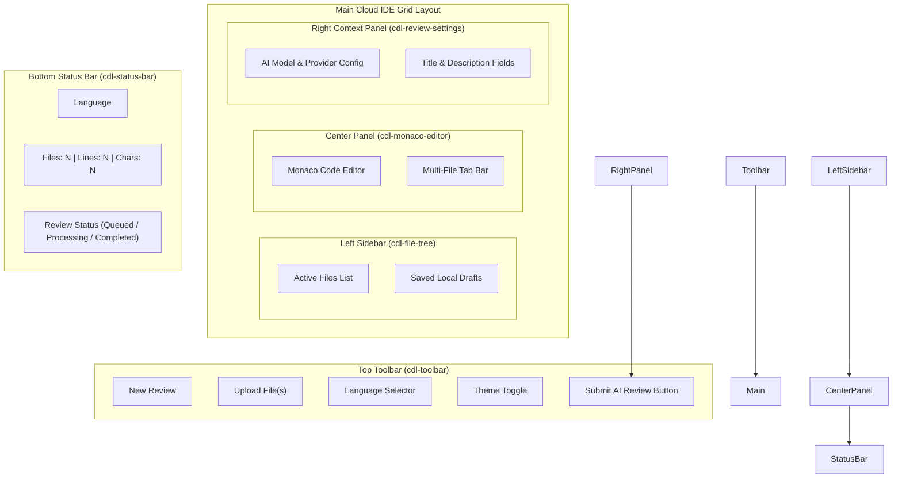

# 💻 Phase F4 — Code Review Workspace Architecture Specification

## 1. Executive Cloud IDE Architecture
The **Code Review Workspace Module** (`apps/frontend/src/app/features/workspace`) provides a high-performance, browser-based cloud IDE where developers paste, upload, edit, review, and submit source code for AI-powered code analysis.

Built with **Angular Standalone Components**, **Monaco Editor**, **Angular Signals**, and **OnPush Change Detection**, the workspace delivers a seamless developer experience with 60fps editing performance.

---

## 2. Workspace IDE Layout Topology & Flow



---

## 3. Signal Workspace Store Architecture (`WorkspaceStore`)

```typescript
export interface WorkspaceFile {
  id: string;
  filename: string;
  language: string;
  content: string;
  sizeBytes: number;
  isModified: boolean;
}

export interface EditorSettings {
  theme: 'vs-dark' | 'vs-light';
  fontSize: number;
  wordWrap: 'on' | 'off';
  minimap: boolean;
  autoIndent: boolean;
}

export interface WorkspaceState {
  files: WorkspaceFile[];
  activeFileId: string | null;
  title: string;
  description: string;
  repository: string;
  branch: string;
  aiProvider: string;
  selectedLanguage: string;
  status: 'IDLE' | 'QUEUED' | 'PROCESSING' | 'COMPLETED' | 'FAILED';
  progressPercentage: number;
  isSubmitting: boolean;
  isDirty: boolean;
  lastDraftSavedAt: Date | null;
  editorSettings: EditorSettings;
  error: string | null;
}
```

### Derived Computed Signals:
- `activeFile`: `computed(() => state.files().find(f => f.id === state.activeFileId()) || null)`
- `totalLineCount`: `computed(() => state.files().reduce((acc, f) => acc + f.content.split('\n').length, 0))`
- `totalCharCount`: `computed(() => state.files().reduce((acc, f) => acc + f.content.length, 0))`
- `fileCount`: `computed(() => state.files().length)`
- `isValidSubmission`: `computed(() => state.title().trim().length >= 3 && state.files().length > 0 && state.files().every(f => f.content.trim().length > 0))`

---

## 4. Component Decomposition & Responsibilities

| Component Name | Role | Responsibilities |
| :--- | :--- | :--- |
| **`WorkspacePageComponent`** | Smart Container | Injects `WorkspaceStore`, handles review submission, orchestrates WebSockets |
| **`WorkspaceLayoutComponent`** | Layout Container | Grid CSS flexbox layout managing Toolbar, Sidebar, Editor, Context Panel, and Status Bar |
| **`ToolbarComponent`** | Dumb Component | Top bar containing action triggers ("New Review", "Upload", "Submit", Language Selector) |
| **`MonacoEditorComponent`** | Dumb Component | Embeds Monaco Editor, manages syntax models, language switching, theme & minimap |
| **`FileTreeComponent`** | Dumb Component | Renders active files list, file selection tabs, add/remove file triggers |
| **`FileUploadComponent`** | Dumb Component | Drag-and-drop file upload zone, extension/MIME validation, size limit checks |
| **`StatusBarComponent`** | Dumb Component | Bottom bar metrics (Language, File count, Line count, Character count, Status badge) |
| **`ReviewProgressComponent`** | Dumb Component | Modal/Overlay progress indicator for async AI analysis steps |

---

## 5. Incremental Step Roadmap for Phase F4

1. ✅ **Step 1: Workspace Architecture** (Architecture Blueprint & Signal IDE Store)
2. 开启 **Step 2: Folder Structure** (Creating `features/workspace` directory structure)
3. ⏳ **Step 3: Workspace Models** (TypeScript interfaces for Files, Editor, Review Request DTOs)
4. ⏳ **Step 4: Workspace Services** (WorkspaceApiService HTTP integration)
5. ⏳ **Step 5: Monaco Editor Integration** (`MonacoEditorComponent` implementation)
6. ⏳ **Step 6: Language Selector Component** (`LanguageSelectorComponent` selector)
7. ⏳ **Step 7: File Upload Component** (`FileUploadComponent` & `DragDropZoneComponent`)
8. ⏳ **Step 8: Workspace Layout Component** (`WorkspaceLayoutComponent` IDE grid)
9. ⏳ **Step 9: Review Submission Flow** (Form validation, `POST /reviews` dispatch)
10. ⏳ **Step 10: WebSocket Integration** (Real-time review processing updates)
11. ⏳ **Step 11: Status Bar & Sidebar** (`StatusBarComponent` & `FileTreeComponent`)
12. ⏳ **Step 12: Draft Management** (Debounced LocalStorage auto-save & recovery)
13. ⏳ **Step 13: Testing** (Unit & Integration tests for Monaco & WorkspaceStore)
14. ⏳ **Step 14: Documentation** (Feature README & Workspace Guide)
