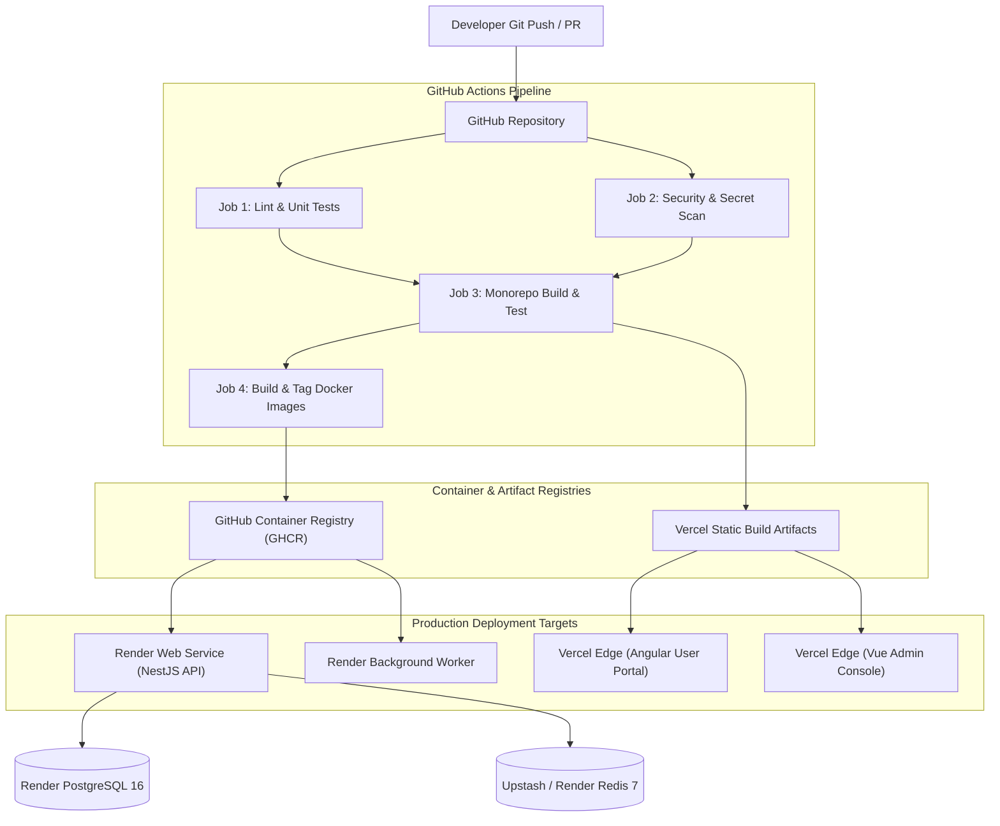

# 🏛️ Phase 10 — Enterprise DevOps & Deployment Infrastructure Architecture Specification

## 1. System Overview
Phase 10 establishes a production-grade **DevOps, Infrastructure as Code (IaC), and Automated CI/CD Pipeline Engine** for the CodeLens platform. Designed to satisfy Twelve-Factor App methodologies, the architecture guarantees immutable container builds, zero-downtime deployments, environment isolation, automated security auditing, and automated disaster recovery.

Key Infrastructure Highlights:
- **Multi-Stage Containerization**: Non-root `node:18-alpine` containers utilizing multi-stage builds (`base`, `dependencies`, `builder`, `production`) to minimize image sizes (<150MB) and attack surfaces.
- **Environment Isolation**: Dedicated Docker Compose configurations for **Local Development**, **Testing / CI**, **Staging**, and **Production**.
- **Automated GitHub Actions Pipelines**:
  - `ci.yml`: Pull Request validation (ESLint, Jest Unit & Integration tests, TypeCheck, Prisma Validation).
  - `security-scan.yml`: Trivy container vulnerability scanner & Snyk secret leakage checks.
  - `cd.yml`: Automated Render (Backend API + Workers) and Vercel (Angular Developer Portal + Vue Admin Console) deployment on release tag or main merge.
- **Deployments**:
  - **NestJS API & Workers**: Deployed on Render with health/liveness probes and automatic horizontal scaling.
  - **Angular User Portal & Vue Admin**: Deployed as static SPA builds on Vercel Edge Network with CDN caching.
  - **PostgreSQL 16 & Redis 7**: Managed infrastructure with automated snapshots and WAL archiving.

---

## 2. CI/CD Pipeline Architecture & Deployment Flow

---

## 3. Environment & Secret Management (12-Factor App)

| Variable | Environment Scope | Description | Secret Policy |
| :--- | :--- | :--- | :--- |
| `NODE_ENV` | All | Runtime environment (`development`, `staging`, `production`) | Public |
| `PORT` | Backend | HTTP API server listen port (default `4000`) | Configurable |
| `DATABASE_URL` | Staging / Prod | PostgreSQL connection string with SSL pooling | Encrypted Secret |
| `REDIS_HOST` / `REDIS_PORT` | Staging / Prod | Redis cluster endpoint & credentials | Encrypted Secret |
| `JWT_SECRET` | Staging / Prod | HMAC SHA-256 signing secret for authentication tokens | Encrypted Secret (Min 64-char) |
| `GEMINI_API_KEY` | Staging / Prod | Google Gemini AI provider API credential | Encrypted Secret |
| `OPENAI_API_KEY` | Staging / Prod | OpenAI GPT provider API credential | Encrypted Secret |

---

## 4. Implementation Order & Roadmap

1. ✅ **Step 1: DevOps Architecture** (Infrastructure Specification, CI/CD Topology, Deployment Target Design)
2. ⏳ **Step 2: Dockerfiles** (Multi-stage non-root Dockerfiles for NestJS Backend, Angular Frontend, Vue Admin)
3. ⏳ **Step 3: Docker Compose** (Orchestration files for `dev`, `test`, `staging`, and `production`)
4. ⏳ **Step 4: Environment Configuration** (`.env.example`, environment validation schemas)
5. ⏳ **Step 5: GitHub Actions** (Automated workflows for CI, Security Scans, CD, Release Tagging)
6. ⏳ **Step 6: Deployment Configuration** (Render `render.yaml` & Vercel `vercel.json` deployment manifests)
7. ⏳ **Step 7: Health Checks** (Liveness `/health/liveness`, Readiness `/health/readiness`, Terminus probes)
8. ⏳ **Step 8: Backup Strategy** (Automated PostgreSQL pg_dump backup script & restore runbook)
9. ⏳ **Step 9: Logging** (Structured JSON logger, request-id tracing, log rotation)
10. ⏳ **Step 10: Security** (Trivy scanner, container non-root enforcement, security headers)
11. ⏳ **Step 11: Documentation** (Deployment Guide, Docker Guide, CI/CD Runbook, Backup & Disaster Recovery Guide)
